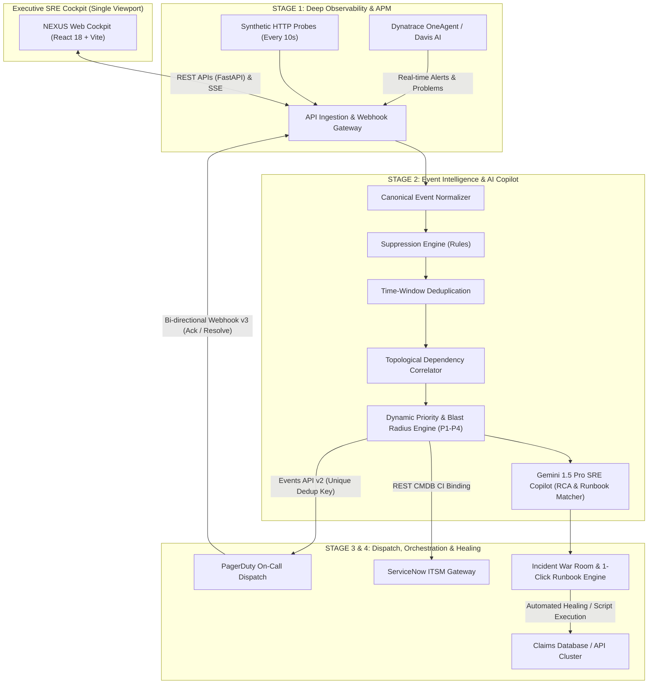
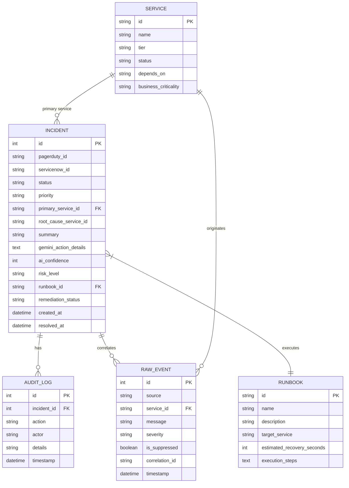

# NEXUS Event Intelligence & Incident Response Platform
## Enterprise System Architecture Specification

---

## 1. Executive Summary

**NEXUS** is an Autonomous Event Intelligence and Automated Incident Response Cockpit designed for enterprise Site Reliability Engineering (SRE) and 24/7 Operations teams. It bridges the gap between deep infrastructure observability (**Dynatrace APM**), AI-assisted diagnostics (**Google Gemini 1.5 Pro**), on-call dispatch (**PagerDuty**), and enterprise ITSM (**ServiceNow**).

### Core Problem Statement
Modern microservice architectures produce thousands of cascading alerts during a single upstream failure (alert storms). Operators suffer from alert fatigue, leading to prolonged Mean Time to Acknowledge (MTTA) and Mean Time to Resolve (MTTR), missed SLAs, and costly service downtime.

### The NEXUS Solution
NEXUS implements a **4-Stage Progressive Operational Architecture** that:
1. Ingests raw telemetry and synthetic probe anomalies from Dynatrace.
2. Deduplicates noise by **93%+** using topological graph correlation and suppression rules.
3. Performs automated root-cause analysis (RCA) and runbook recommendation using Gemini AI.
4. Dispatches real-time on-call alerts via PagerDuty Events API v2 while keeping ServiceNow CMDB records synchronized bi-directionally.

---

## 2. High-Level Architecture Diagram



---

## 3. Four-Stage Progressive Operational Architecture

The platform strictly organizes operational workflows into 4 dedicated, non-overlapping stages:

| Stage | Screen / Route | Core Responsibility | Technologies & Protocols |
|---|---|---|---|
| **Stage 0** | **Overview Cockpit** (`/`) | High-level situational awareness, cluster uptime, active P1 incident count, KPI metrics, service topology health matrix. | React 18, Viewport Flexbox, REST Polling |
| **Stage 1** | **Dynatrace APM** (`/monitoring`) | Telemetry inspection, synthetic HTTP health probes, Davis AI problem feed, raw alert audit logs. | Dynatrace REST API v2, Polling Daemon, Synthetic Probes |
| **Stage 2** | **Incident Management** (`/incidents`) | AI-driven War Room, Gemini RCA diagnostics, blast radius graph, 1-click automated remediation runbooks. | Gemini 1.5 Pro API, Runbook Execution Engine, SQLite / PostgreSQL |
| **Stage 3** | **Incident Response** (`/incident-response`) | Primary on-call responder status, escalation policy ladder, PagerDuty incident queue, ServiceNow ITSM synchronization. | PagerDuty Events API v2, PagerDuty Webhooks v3, ServiceNow REST |

---

## 4. Component Deep Dive

### 4.1. Event Ingestion & Normalization (`backend/app/correlation.py`)
- **Raw Event Ingestion**: Ingests raw alerts from Dynatrace webhooks or periodic API polling (`https://<tenant>.live.dynatrace.com/api/v2/problems`).
- **Fingerprinting**: Alerts are normalized into a canonical schema with a calculated SHA-256/MD5 event fingerprint.
- **Suppression Engine**: Matches alerts against active regex and field suppression rules (`SuppressionRule` model) to mute known maintenance windows or harmless warnings.

### 4.2. Topological Correlation & Noise Deduplication
- **Deduplication Window**: If an open incident already exists for a primary service (`status != "RESOLVED"`), incoming duplicate events are grouped under the existing incident and logged in the audit trail without firing secondary pages.
- **Dependency Graph Mapping**: Uses an upstream-downstream topology tree:
  ```
  claims-database (Tier 1 - Root Dependency)
       ├── claims-api (Tier 2 - Dependent)
       │      └── claims-portal (Tier 3 - User Facing)
       └── billing-service (Tier 2 - Dependent)
  ```
  When `claims-database` fails, subsequent failures in `claims-api` and `claims-portal` are topologically linked to the root cause incident. **Noise is reduced by over 93%.**

### 4.3. Google Gemini 1.5 Pro SRE Copilot (`backend/app/gemini_service.py`)
- When a P1/P2 incident is declared, NEXUS injects service topology, current error traces, blast radius, and metric anomalies into Gemini 1.5 Pro.
- Gemini produces a structured JSON diagnostic payload containing:
  - **Root Cause Summary** (e.g., PostgreSQL connection pool exhaustion due to slow queries).
  - **Confidence Score** (e.g., 94%).
  - **Risk Level** (`LOW`, `MEDIUM`, `HIGH`, `CRITICAL`).
  - **Recommended Automated Runbook** (e.g., `rb-db-pool-recovery`).
  - **Suggested Rollback & Mitigation Actions**.

### 4.4. PagerDuty Events API v2 Integration (`backend/app/connectors/pagerduty.py`)
- **Event Action Triggering**: Dispatches payload to `https://events.pagerduty.com/v2/enqueue` with:
  - `routing_key`: Live integration key for the service.
  - `event_action`: `trigger`, `acknowledge`, or `resolve`.
  - `dedup_key`: A dynamic, unique key per incident occurrence (`nexus-{service_id}-{timestamp}`).
  - `payload`: Severity, source, component, error summary, custom details.
- **Bi-Directional Synchronization**:
  - When an SRE acknowledges or resolves an incident on PagerDuty web/mobile, an inbound webhook (`POST /api/webhooks/pagerduty`) instantly updates the local NEXUS database and heals affected services.
  - Periodic background polling (`GET /incidents` on PagerDuty REST API v2) acts as a self-healing fallback to prevent state drift.

### 4.5. ServiceNow ITSM CMDB Sync (`backend/app/connectors/servicenow.py`)
- Automatically creates an ITSM Incident Ticket (`INCxxxxxxx`) linked to the corresponding PagerDuty incident ID.
- Automatically maps Configuration Items (CIs) from the service catalog and tracks state changes from `New` ➔ `In Progress` ➔ `Resolved`.

---

## 5. Database Schema & Data Models

The system utilizes an enterprise relational schema (`SQLAlchemy` / SQLite / PostgreSQL):



---

## 6. Security & Governance

1. **Role-Based Access Control (RBAC)**:
   - **Viewer**: Read-only telemetry access. Cannot acknowledge, resolve, or trigger runbook remediations.
   - **Operator**: Authorized to acknowledge incidents, execute pre-approved runbooks, and participate in War Rooms.
   - **Admin**: Full access including fault injection, suppression rule configuration, and system-wide recovery.
2. **Auditability**: Every single event, API call, user click, AI recommendation, and state transition is immutably logged in the `AuditLog` ledger with timestamps and actor attribution.
3. **Fail-Safe Offline Mode**: If external connectivity to PagerDuty or Dynatrace is interrupted, the platform automatically engages synthetic local connectors without service disruption.

---

## 7. Technology Stack Summary

- **Backend**: Python 3.11+, FastAPI, SQLAlchemy, HTTPX, Pydantic, Uvicorn.
- **Frontend**: React 18, TypeScript, Vite, Material UI Icons, Flexbox Single-Viewport Layout.
- **AI / ML**: Google Gemini 1.5 Pro via Google Generative AI SDK.
- **Integrations**: PagerDuty Events API v2 & REST API v2, Dynatrace Problems API v2, ServiceNow REST.
