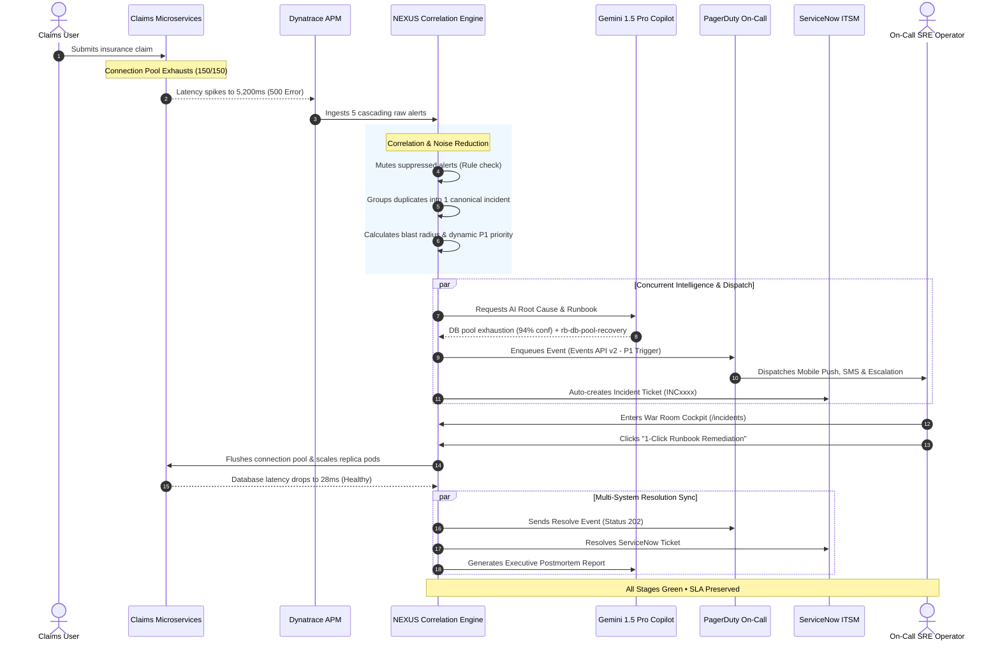
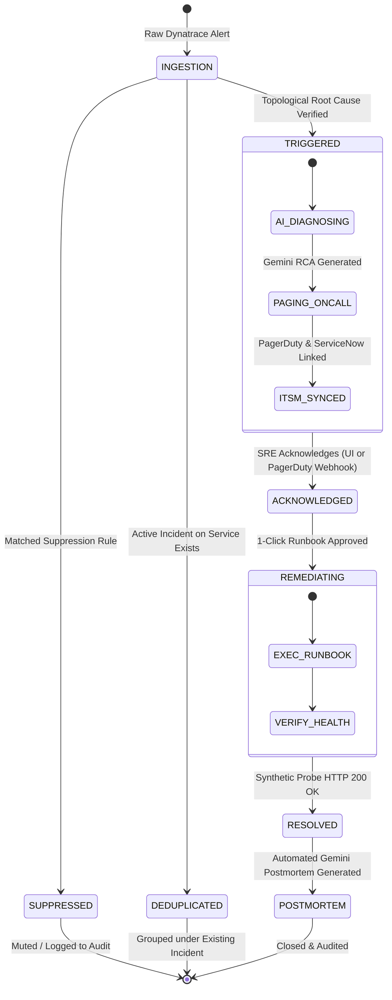

# NEXUS Autonomous Incident Lifecycle Workflow
## Standard Operating Procedures & Operational Flow

---

## 1. End-to-End Operational Lifecycle Overview

The NEXUS platform automates the entire lifecycle of an incident across 8 continuous phases, transforming raw infrastructure anomalies into resolved incidents with zero manual toil.

---

## 2. Incident State Machine

Every incident moves through a strictly governed finite state machine:

---

## 3. The 8 Operational Lifecycle Steps

### Step 1: Automated Anomaly Detection (Dynatrace APM)
- Dynatrace OneAgent and Synthetic HTTP Probes continuously monitor key customer paths (e.g., `POST /claims/submit`).
- When database pool connections saturate, response times exceed the 2,000ms SLA threshold, and HTTP 500 error rates exceed 5%.
- Dynatrace Davis AI detects the anomaly and pushes a problem alert to NEXUS.

### Step 2: Event Normalization & Rule Suppression
- NEXUS normalizes incoming payload into a standard `CanonicalEvent`.
- The Suppression Engine matches the event against active regex rules (e.g., scheduled database vacuuming or sandbox services).
- Suppressed events are stored in the audit trail without triggering pages.

### Step 3: Topological Correlation & Blast Radius Calculation
- The Correlation Engine analyzes the dependency topology:
  - `claims-database` is identified as the **Tier 1 Root Cause**.
  - Cascading alerts from downstream dependents (`claims-api`, `claims-portal`) are automatically grouped under the root cause incident.
- Blast radius is evaluated dynamically: **3 services impacted**, estimated revenue exposure: **$37,500/hr**.
- Priority is automatically scored as **P1 Critical**.

### Step 4: Gemini 1.5 Pro Root Cause Analysis (RCA)
- The diagnostic context (topology graph, error messages, active connections, and latency logs) is sent to Gemini AI.
- Within 2 seconds, Gemini synthesizes:
  - **Identified Failure**: PostgreSQL connection pool exhaustion triggered by unindexed slow queries.
  - **Confidence**: 94%.
  - **Risk Rating**: HIGH.
  - **Remediation Match**: Runbook `rb-db-pool-recovery` (Flushes idle connections, restarts connection pooling daemon, rebalances API gateway).

### Step 5: PagerDuty On-Call Dispatch & Escalation
- NEXUS generates a unique event deduplication key: `nexus-claims-database-<timestamp>`.
- The event is enqueued to PagerDuty Events API v2.
- PagerDuty triggers an immediate high-urgency incident, alerting the Primary On-Call SRE (Alex Chen) via mobile push, SMS, and phone call.
- The 15-minute escalation timer starts automatically.

### Step 6: ServiceNow CMDB Ticket Creation
- The ServiceNow ITSM connector creates a ticket (`INC0089241`) linked directly to the PagerDuty incident ID.
- Maps affected Configuration Items (CIs) in the enterprise CMDB for compliance and tracking.

### Step 7: Incident War Room & 1-Click Remediation
- The SRE opens the **Incident Management War Room** (`/incidents`).
- The War Room displays:
  - Executive Incident Summary & Gemini AI diagnostic findings.
  - Interactive Blast Radius topology map.
  - Pre-staged, validated 1-click runbook (`rb-db-pool-recovery`).
- The operator clicks **"Execute Remediation"**. The runbook executes in under 8 seconds.

### Step 8: Automated Verification, Sync & Postmortem
- The synthetic probe confirms `claims-database` latency has normalized to `< 30ms` (HTTP 200 OK).
- NEXUS automatically sends a `resolve` event to PagerDuty Events API v2, silencing all pagers.
- ServiceNow ticket is closed as `Resolved`.
- Gemini Copilot automatically generates an executive postmortem summary detailing timeline, root cause, blast radius, and preventive recommendations.

---

## 4. Role-Based Operating Procedures

| Action | Viewer | Operator | Admin |
|---|:---:|:---:|:---:|
| View Cockpit, Metrics & Topology | ✅ | ✅ | ✅ |
| Inspect Dynatrace Telemetry & Raw Alerts | ✅ | ✅ | ✅ |
| Acknowledge P1 Incidents | ❌ | ✅ | ✅ |
| Execute Pre-Approved Remediation Runbooks | ❌ | ✅ | ✅ |
| Resolve Incidents & Silence Pagers | ❌ | ✅ | ✅ |
| Configure Suppression Rules | ❌ | ❌ | ✅ |
| Trigger Simulation Fault Cascades | ❌ | ❌ | ✅ |
| Execute System-Wide Emergency Recovery | ❌ | ❌ | ✅ |

---

## 5. Operational SLAs & Targets

- **Mean Time to Detect (MTTD)**: `< 15 seconds` (Dynatrace OneAgent + Synthetic Probes)
- **Noise Reduction Efficiency**: `> 93%` (Topological correlation & time-window dedup)
- **Mean Time to Acknowledge (MTTA)**: `< 2 minutes` (Target SLA `< 5 minutes`)
- **Mean Time to Remediate (MTTR)**: `< 8 minutes` (Down from enterprise baseline of 35+ minutes)
- **Audit Compliance**: `100%` immutable logging across all user and machine actions.
